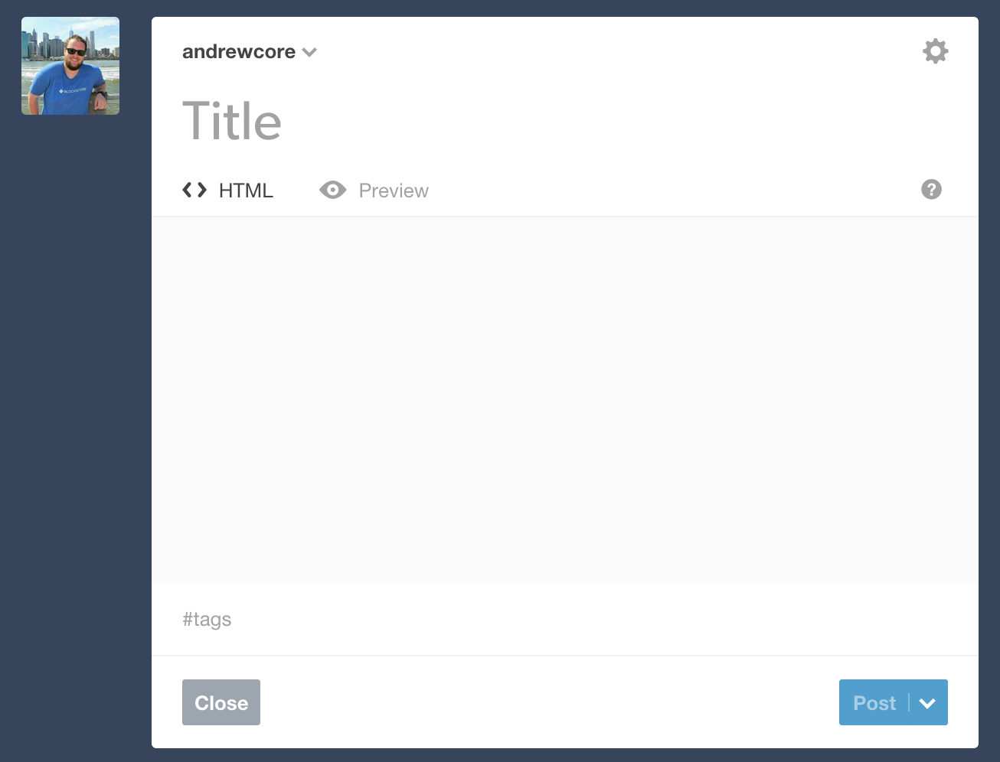
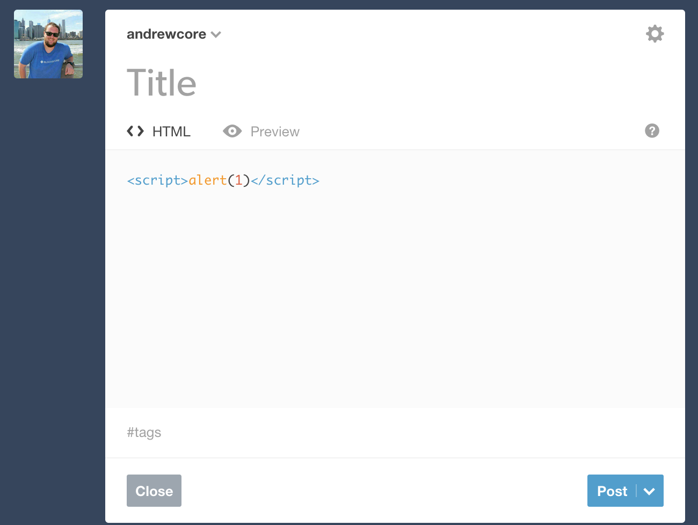
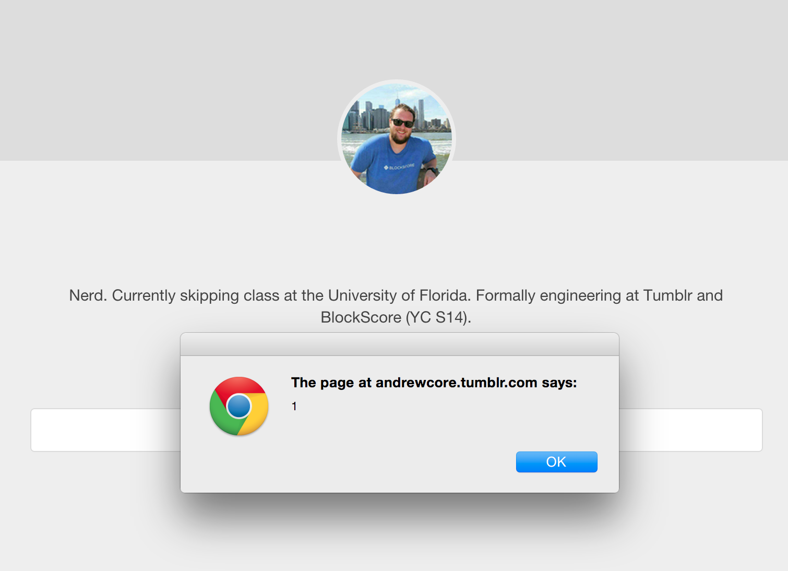
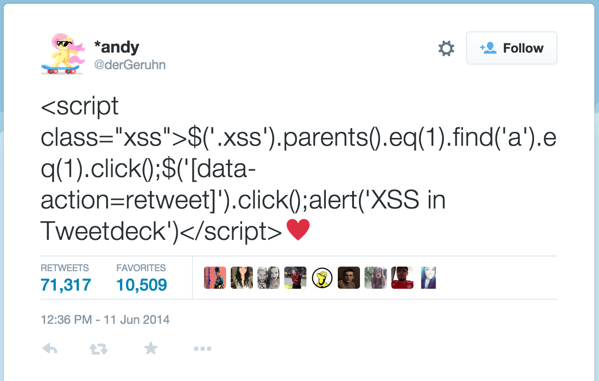
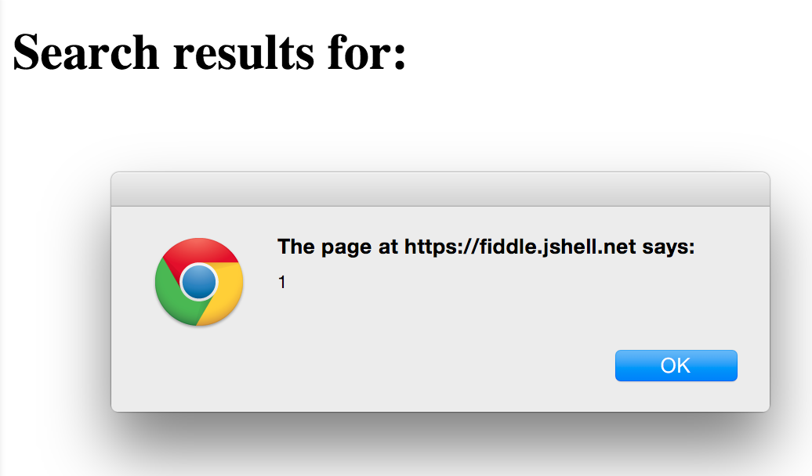
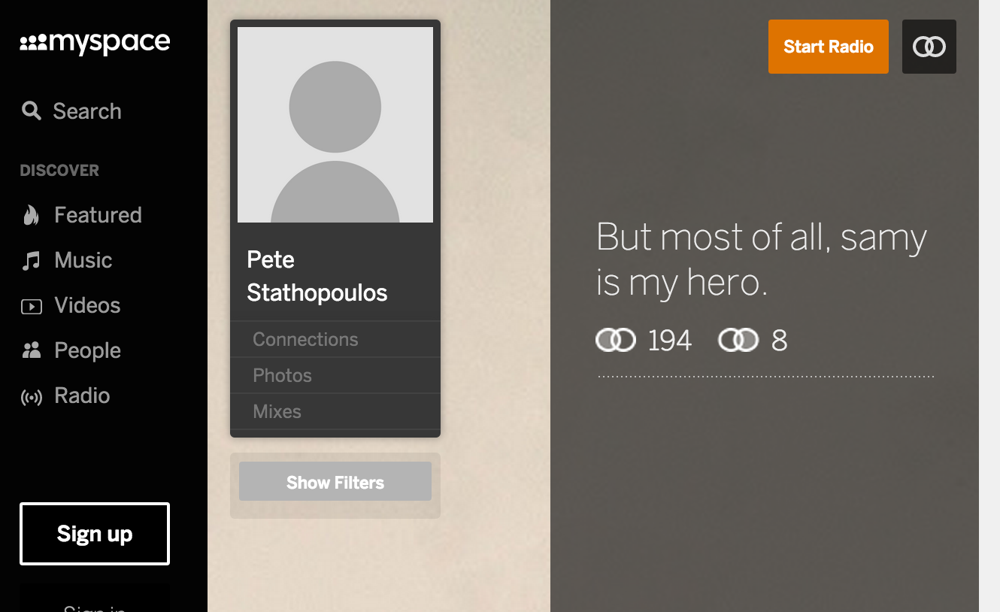
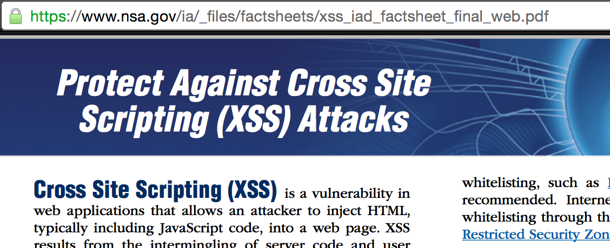

footer: XSS | Andrew Kerr
slidenumbers: true

# Cross-site Scripting
## (Also known as XSS)
### Andrew Kerr | Sept 8, 2015
### <me@andrewjkerr.com>

---

## whoami

- Fifth year Software Engineering @ UF
- Secretary of UFSIT for > 2yrs
- Full stack web developer
- Former security intern at Tumblr
- Former intern at BlockScore

---

## XSS

> Cross-Site Scripting (XSS) attacks are a type of injection, in which malicious scripts are injected into otherwise benign and trusted web sites. XSS attacks occur when an attacker uses a web application to send malicious code, generally in the form of a browser side script, to a different end user.
-- OWASP

^ OWASP == Open Web Application Security Project; is a not-for-profit charitable organization focused on improving the security of software

^ OWASP Top 10 is a good place to start learning about web security

---

## Ok... what does that mean?

---



^ Let's say we have a form

^ How would we put JavaScript into this form?

---



^ Sure, let's put some JavaScript in there

---



^ Woah there! That's cool!

^ Now, keep in mind that there are mitigations to this which we'll talk about later.

---

## Why does this work?

- Browser is tricked into thinking the code is part of the site
- Backend server does not sanitize input correctly
- Poor client-side JavaScript executes given parameters

^ Browser is stupid and runs anything it's given!

^ Since browser is stupid, we need to sanitize input - we'll talk about how later

^ Site JavaScript allows for injectable JavaScript parameters

---

## Why do it?

- Steal session cookies
- Steal logins by defacing
- Exploit the browser/plugins
- For the lulz

^ Session cookies keep track of login

^ Can inject a script to create a "login" page that sends creds to your server

^ BeEF hooks can turn your browser into a "zombie"

^ Forceful retweets!

---


## Remember this?

- :heart: emoji broke XSS sanitization on TweetDeck
- Auto-magically retweeted itself 70,000+ times
- Good thing it wasn't malicious!

---

## Ok, but it's Twitter... why does it matter?

---


^ Twitter and social media has real-world consequences now

^ Source: https://www.washingtonpost.com/news/worldviews/wp/2013/04/23/syrian-hackers-claim-ap-hack-that-tipped-stock-market-by-136-billion-is-it-terrorism/

---

## XSS Payloads

- A __TON__ of possible XSS payloads
- `<script>alert(1)</script>`
- ``
- `<a href="javascript: alert(1)">Click me!</a>`
- and more!

^ We'll come back to some of these later

---

## Types of XSS

1. Reflected
2. Stored
3. DOM-based

---

## Reflected XSS

- Ability to inject code and have the server return it back, unsanitized
    - Not stored on the server/in a database!
- Normally hidden in the URL
    - Don't click on random links!
- Example: search forms showing input on results page after submission

---

## Reflected XSS Vulnerable Code Example

```php
// www.site.com/search.php?q=search+query
$search_query = $_GET['q'];
echo '<h1>Search results for: ' . $search_query . '</h1>;

```

---

## www.site.com/search.php?q=<script>alert(1)</script>

---



^ Reflected because it's a search result!

---

## Reflected XSS Vulnerable Code Example

```php
// www.site.com/search.php?q=search+query
$search_query = $_GET['q'];
echo '<h1>Search results for: ' . $search_query . '</h1>;

```

Q: What's wrong with this code?
A: UNSANITIZED USER INPUT

---

## Stored XSS

- Ability to inject code and have the server store it and return it without sanitizing it in either case
- HOLY CRAP THIS IS HORRIBLE
    - Only way for end user to protect themselves is to disable JS
- Example: form post storing XSS

^ Remember earlier?

---


^ https://twitter.com/dergeruhn/status/476764918763749376

---

## Samy MySpace worm

- Posted 'but most of all, samy is my hero' to victims
- Fastest spreading virus of all time
    - 1+ million runs in ~20hrs



^ Still there!

---

## Stored XSS Vulnerable Code Example

```php
// Storing posts
$post = $_POST['post'];
$query = $mysql_conn->prepare("INSERT INTO posts VALUES ('" . $post . "')");
$query->execute();

// Fetching and outputting posts
$query = $mysql_conn->prepare("SELECT * FROM posts");
$query->execute();
$query->bind_result($post);
while($query->fetch()) {
    echo '<p>' . $post . '</p>';
}
```

Q: What's the issue?
A: UNSANITIZED USER INPUT

^ Unsanitized on both input AND output

^ Ask: How would you exploit this?

---

## DOM-based XSS

- Similar to Reflected, _but_ is not rendered from the server.
- Normally due to bad JavaScript code
- Also crafted by a URL
    - Don't let users pass in JS via the URL!

---

## DOM-based XSS Vulnerable Code Example

```javascript
// Pretend parse_get_params is imeplemented :)
var title = parse_get_params('title');
$('.page-header').html("<h1>" + title + "</h1>");
```

Q: And, what's the issue here?
A: UNSANITIZED USER INPUT

---

## DOM-based XSS Vulnerable Code Example

```javascript
// Pretend parse_get_params is imeplemented :)
var title = parse_get_params('title');
$('.page-header').html("<h1>" + title + "</h1>");
```

Q: How would we exploit this?
A: Craft a URL like:
`www.site.com/page.html?title=`

---

## Protecting Against XSS

```javascript
// Pretend parse_get_params is imeplemented :)
var title = parse_get_params('title');
$('.page-header').html("<h1>" + title + "</h1>");
```

- jQuery provides a `.html` AND `.text`.
- But, what's the difference?

---

## Protecting Against XSS

> Set the text contents of the matched elements.
-- `.text()`

<br />

> Set the HTML contents of each element in the set of matched elements.
-- `.html()`

---

## Protecting Against XSS


```html
<html>
<head>
  <title>Test Page</title>
  <script type="text/javascript" src="jquery.min.js"></script>
  <script type="text/javascript">
    $(function(){
      $("#div1").html('<a href="example.html">Link</a><b>hello</b>');
      $("#div2").text('<a href="example.html">Link</a><b>hello</b>');
    });
  </script>
</head>

<body>

<div id="div1"></div>
<div id="div2"></div>

</body>
</html>
```

---

## Protecting Against XSS

1. Know your framework/library/language!
2. SANITIZE!
3. Whitelist, not blacklist
4. Headers

^ jQuery is popular and knowing these things means the difference between pwned and safe!

^ Sometimes, knowing your framework/language will help you sanitize

^ Whitelisting is a much better thing than blacklisting

^ Content-Security-Policy, X-XSS-Protection

---

## Protecting Against XSS


- Or, ya know, read the NSA's recommendations.
- https://www.nsa.gov/ia/_files/factsheets/xss_iad_factsheet_final_web.pdf

---

## But most importantly...
# TEST YOUR APPLICATION


^ Seriously. Do it. Automated scanners, by hand, who cares? JUST DO IT.

^ In order to test, we need to know how to...

---

## Bypassing Filters

- Wonderful cheatsheet by OWASP: https://www.owasp.org/index.php/XSS_Filter_Evasion_Cheat_Sheet
- Also, some guess work helps!

---

## Bypassing Filters Vulnerable Code Example

```php
$input = $_POST['input'];
$sanitized = str_replace('script', '', $input);
```

Q: How could we get by this?
A: Think about it :)

^ Challenges!

---

## Resources

- OWASP
- The Web Application Hackers Handbook
- Mutillidae Practice Application

---

## Challenges

- Server: 104.236.76.214
- Source: github.com/ufsit/xss-challenges
  - Try not to use this!
- Cheatsheet: https://www.owasp.org/index.php/XSS_Filter_Evasion_Cheat_Sheet
