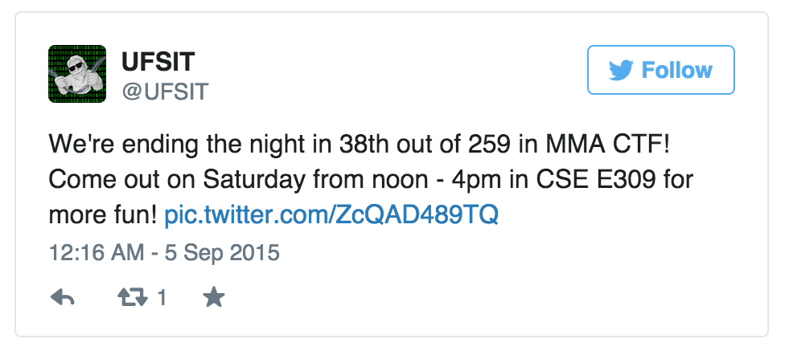
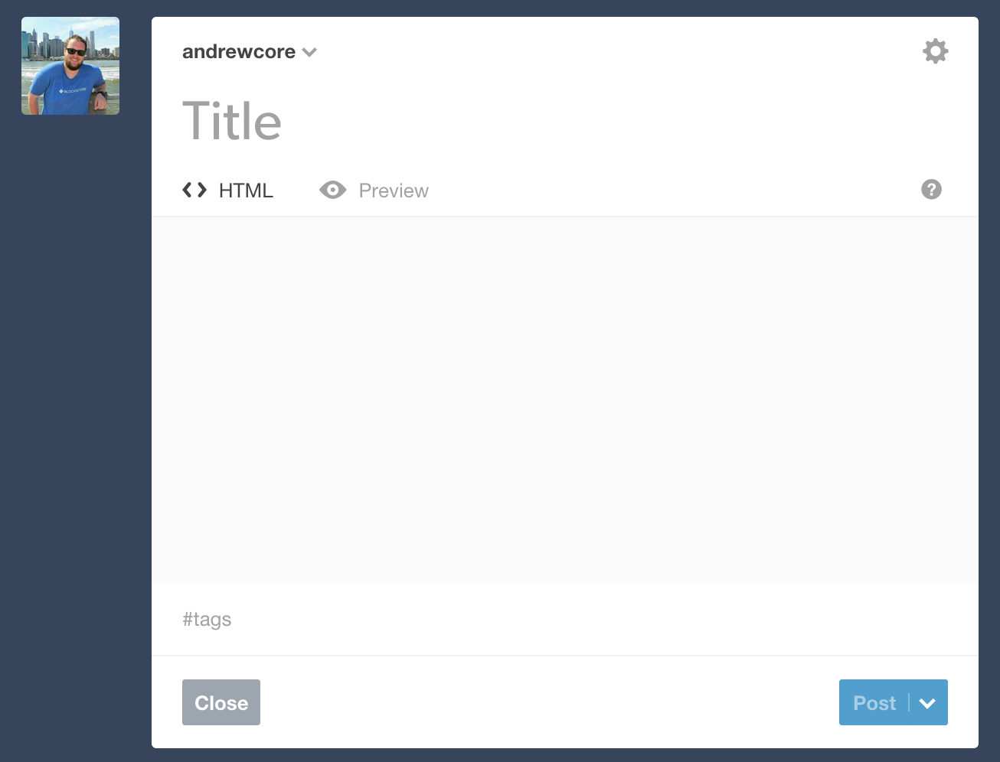
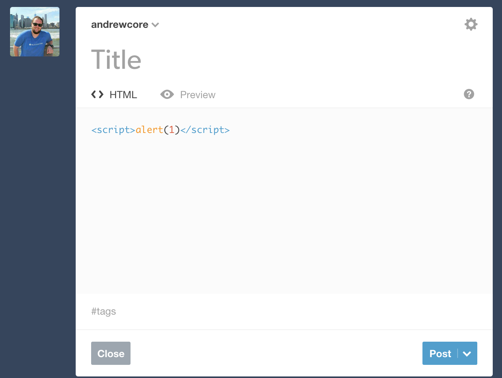
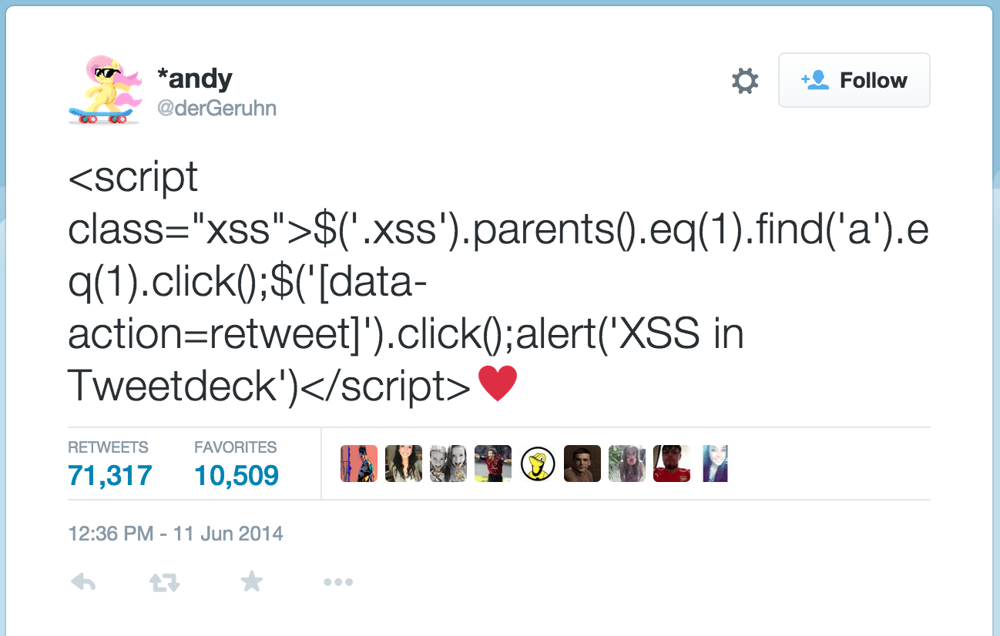

footer: XSS | Andrew Kerr
slidenumbers: true

# Cross-site Scripting
## (Also known as XSS)
### Andrew Kerr | Sept 8, 2015
### <me@andrewjkerr.com>

---

## whoami

---

## whoami

- Fifth year Software Engineering @ UF

---

## whoami

- Fifth year Software Engineering @ UF
- Secretary of UFSIT for > 2yrs

---

## whoami

- Fifth year Software Engineering @ UF
- Secretary of UFSIT for > 2yrs
- Full stack web developer

^ Primarily on Rails

---

## whoami

- Fifth year Software Engineering @ UF
- Secretary of UFSIT for > 2yrs
- Full stack web developer
- Former security intern at Tumblr

^ Worked on TFA enhancements, Content-Security-Policy, patching vulnerabilities, and more!

---

## whoami

- Fifth year Software Engineering @ UF
- Secretary of UFSIT for > 2yrs
- Full stack web developer
- Former security intern at Tumblr
- Former intern at BlockScore

^ Security specifics - audit for auth bypass, TFA, rate limiting

---

## MMA CTF Recap

---

## MMA CTF Recap
- Lots of people there on Friday!
- Left Friday night in top 15%

^ We solved quite a few challenges which means that...

---

## We want your writeups!

^ Send 'em in! Could be link to your own site or GitHub Gist.

^ OK, cool, let's dive in now...

---

# Cross-site Scripting
## (Also known as XSS)

^ Anyone want to explain XSS?

---

## XSS

> Cross-Site Scripting (XSS) attacks are a type of injection, in which malicious scripts are injected into otherwise benign and trusted web sites. XSS attacks occur when an attacker uses a web application to send malicious code, generally in the form of a browser side script, to a different end user.
-- OWASP

^ OWASP == Open Web Application Security Project; is a not-for-profit charitable organization focused on improving the security of software

^ OWASP Top 10 is a good place to start learning about web security

---

## Ok... what does that mean?

---

^ Let's say we have a form

^ How would we put JavaScript into this form?

---

^ Sure, let's put some JavaScript in there

---

^ Woah there! That's cool!

^ Now, keep in mind that there are mitigations to this which we'll talk about later.

---

## Why does this work?

---

## Why does this work?

- Browser is tricked into thinking the code is part of the site

^ Browser is stupid and runs anything it's given!

---

## Why does this work?

- Browser is tricked into thinking the code is part of the site
- Backend server does not sanitize input correctly

^ Browser is stupid and runs anything it's given!

^ Since browser is stupid, we need to sanitize input - we'll talk about how later

---

### Why does this work?

- Browser is tricked into thinking the code is part of the site
- Backend server does not sanitize input correctly
- Poor client-side JavaScript executes given parameters

^ Browser is stupid and runs anything it's given!

^ Since browser is stupid, we need to sanitize input - we'll talk about how later

^ Site JavaScript allows for injectable JavaScript parameters

---

## Why do it?

---

## Why do it?

- Steal session cookies

^ Session cookies keep track of login

---

## Why do it?

- Steal session cookies
- Steal logins

^ Session cookies keep track of login

^ Can inject a script to create a "login" page that sends creds to your server

---

## Why do it?

- Steal session cookies
- Steal logins
- Exploit the browser/plugins

^ Session cookies keep track of login

^ Can inject a script to create a "login" page that sends creds to your server

^ BeEF hooks can turn your browser into a "zombie"

---

## Why do it?

- Steal session cookies
- Steal logins
- Exploit the browser/plugins
- For the lulz

^ Session cookies keep track of login

^ Can inject a script to create a "login" page that sends creds to your server

^ BeEF hooks can turn your browser into a "zombie"

^ Forceful retweets!

---

---

## Remember this?

- :heart: emoji broke XSS filtering on TweetDeck
- Auto-magically retweeted itself 70,000+ times
- Good thing it wasn't malicious!

---

## Ok, but it's Twitter... why does it matter?

---

^ Twitter and social media has real-world consequences now

---

## Types of XSS

^ Three types

---

## Types of XSS

1. Reflected

---

## Types of XSS

1. Reflected
2. Stored

---

## Types of XSS

1. Reflected
2. Stored
3. DOM-based

---

## Reflected XSS

---

## Reflected XSS

- Ability to inject code and have the server return it back, unsanitized
    - Not stored on the server/in a database!
- Normally hidden in the URL
    - Don't click on random links!
- Example: search forms
